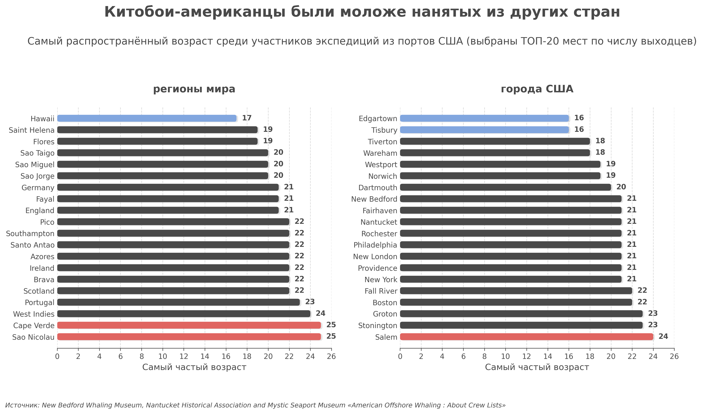
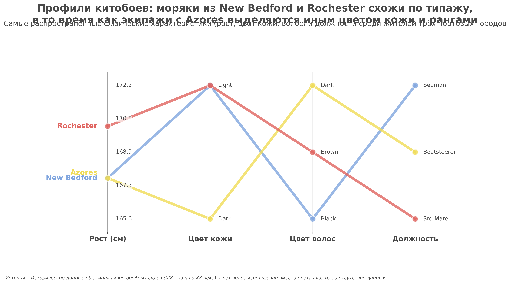
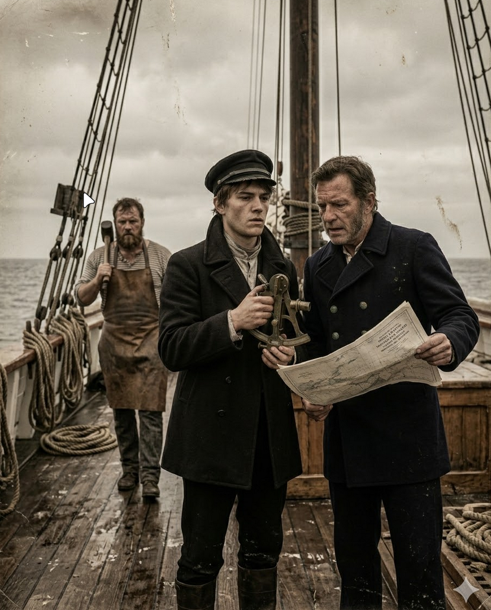

# Adalympics: Исследование экипажей китобойных судов (XIX - XX вв.)

Проект посвящен анализу демографических и физических характеристик моряков на основе исторических данных. Исследование охватывает распределение возраста, роста и профессиональных ролей в зависимости от региона происхождения.

## Основные результаты

### Демография и физические параметры
Анализ показал значительные различия между американскими портами и зарубежными центрами найма. Моряки из США в среднем моложе, в то время как выходцы из Португалии (Азорские острова) и Кабо-Верде часто представляли более зрелое и профессиональное ядро флота.

<div align="center">
  
  <p><i>Распределение возрастов: центры США против мировых регионов</i></p>
</div>

### Профили ключевых групп
На основе модальных значений были реконструированы типичные характеристики моряков для трех стратегических регионов.

<div align="center">
  
  <p><i>Сравнение физических и профессиональных характеристик по регионам</i></p>
</div>

## Реконструкция образов
Визуализация типичных экипажей на основе данных исследования. Каждое изображение представляет группу из трех моряков, характерных для своего региона.

### New Bedford
Центр китобойного промысла. Характеризуется молодым составом и высокой долей рядовых матросов (Seaman).
<div align="center">
  
</div>

### Rochester
Региональный узел, поставлявший квалифицированные кадры и младший командный состав (3rd Mate).
<div align="center">
  
</div>

### Azores
Азорские острова — родина наиболее опытных гарпунеров и специалистов (Boatsteerer).
<div align="center">
  
</div>

---

## Запуск проекта
Для воспроизведения анализа и генерации всех материалов:
```bash
just run
```

### Технологический стек
* **Python (uv)**: pandas, matplotlib, loguru.
* **Just**: автоматизация процессов и QA.
* **Ruff**: линтинг и форматирование.
